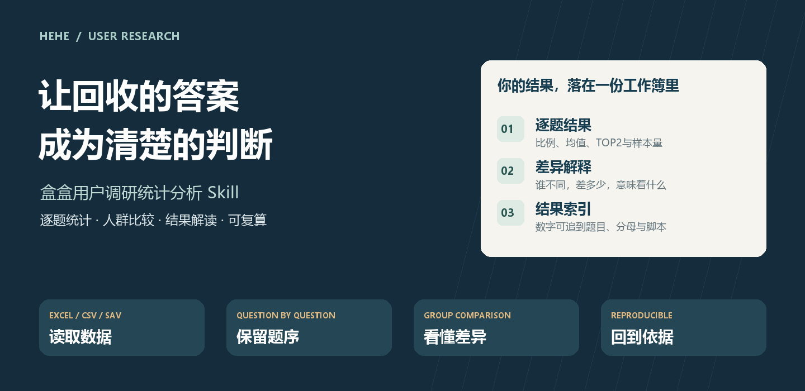
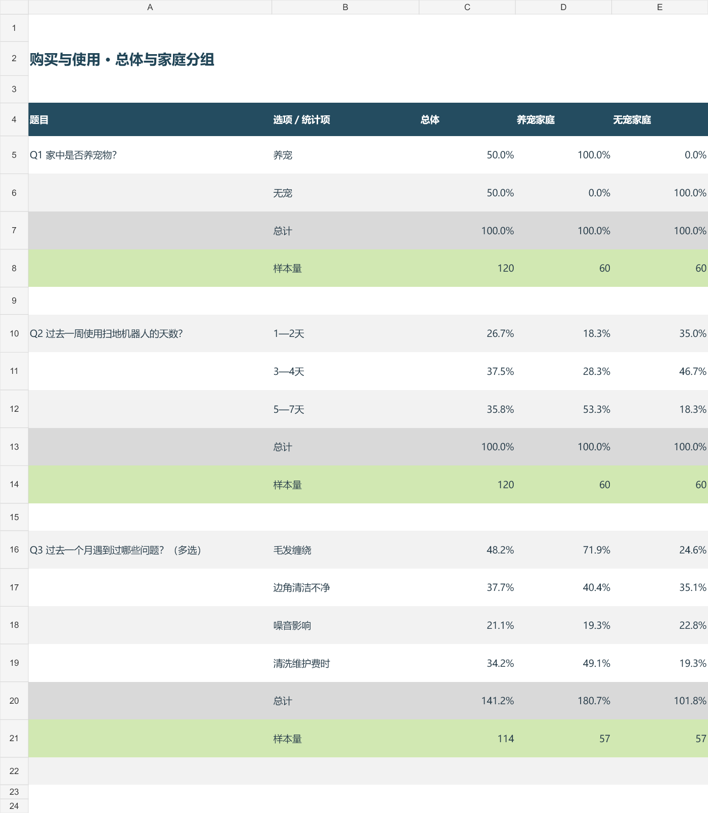

# 盒盒用户调研统计分析 Skill

> 把回收的问卷数据，变成看得懂、查得到、能够支持判断的统计分析工作簿。



[](LICENSE)
[](https://agentskills.io/)
[](release-manifest.json)
[](#安装与开始使用)
[](#拿到的工作簿是什么样)

**`hehe-survey-analysis-workbook` 是盒子原创的独立用户研究 Skill。** 读取 Excel、CSV 或 SPSS SAV 回收数据，理解问卷题型与回答人群，完成逐题统计、交叉分析、适用的差异检验和结果解读，交付可编辑、可复核的 Excel 工作簿及计算脚本。

适合市场研究、用户研究、产品体验、满意度、竞品比较与需求机会分析。既能按照既定分析方案跑数，也能从研究问题出发提出分析方案。

**[下载示例工作簿](examples/robot-vacuum/survey-analysis.xlsx) · [看逐题结果](docs/images/workbook-preview.png) · [查看模拟数据](examples/robot-vacuum/responses.csv) · [查看问卷与口径](examples/robot-vacuum/README.md) · [快速开始](#安装与开始使用)**

## 从“帮我分析一下”，到一份真正能用的结果

你可以这样开始：

> 这是扫地机器人用户调研的数据。帮我比较养宠与无宠家庭的使用问题、满意度和推荐意愿，再看看体验新产品后，购买兴趣有没有变化。

它会围绕问题组织统计工作：

| 你想知道什么 | 它具体做什么 | 你能看到什么 |
|---|---|---|
| 用户最常遇到哪些问题 | 识别多选编码与有效回答人数，计算各选项选择率 | 总体与分组结果、共同排序、每题样本量 |
| 两类家庭有什么不同 | 在同一道题、同一分母口径下做交叉比较 | 相差多少个百分点、差异落在哪些选项 |
| 产品体验有没有改善购买兴趣 | 对齐同一人的体验前后回答，选择配对方法 | 前后变化、上升与下降人数、适用的检验结果 |
| 谁的满意度更高 | 核对量表方向、TOP2含义与各组实际回答人数 | 完整分布、TOP2、均值与差异解释 |
| 这些数字从哪里来 | 为结果保留编号、变量、分子、分母和位置 | 一条能追到源数据与计算脚本的核对路径 |

已经明确的要求直接执行。只有缺失信息会改变结果时，才集中确认，例如某个字段究竟是抽样权重，还是导出过程产生的重复标记。

## 拿到的工作簿是什么样



*上图为仓库内模拟工作簿的实际渲染。示例数据完全合成，用于展示格式与计算，不代表真实市场调查。*

默认交付**一份无图表 Excel 分析工作簿**，以及可重复运行的计算脚本、依赖与运行说明。按问卷模块拆表，按原题号排列；完整分析或要求解读时，另设“数据分析结论”。

| 工作表 | 读者用它做什么 |
|---|---|
| **使用说明** | 看研究对象、样本版本、主要分母、权重与刷新方式 |
| **结果索引** | 按结果ID查题号、指标、分子、分母和具体单元格 |
| **数据分析结论** | 看关键发现、人群差异、实际含义与后续动作 |
| **逐题模块** | 按问卷顺序查看总体和各组结果，每题带样本量 |
| **专项分析** | 查看实际使用的检验、Kano、漏斗或其他专题结果 |
| **数据质检** | 查看重复、缺失、越界、跳题与互斥问题及处置 |
| **题目字典／开放题** | 需要时保留变量标签、选项映射、编码及原文 |

工作表按实际问卷组织，数量随课题变化。结果均可编辑；涉及外部脚本计算的统计量，数据更新后按随附说明重新运行。

### 一道题，一套清楚的口径

常规交叉表采用这样的结构：

| 题目 | 选项／统计项 | 总计 | 养宠家庭 | 无宠家庭 |
|---|---|---:|---:|---:|
| 题干仅在首行出现 | 选项1 | 比例 | 比例 | 比例 |
|  | 选项2 | 比例 | 比例 | 比例 |
|  | 总计 | 合计比例 | 合计比例 | 合计比例 |
|  | 样本量 | 有效人数 | 组内有效人数 | 组内有效人数 |

单选题完整分布合计100%；多选题以有效答题人数为分母，选择率合计可以超过100%。跳题后的题目使用各自回答人群。加权结果同时显示实际人数和权重和。

## 保留下来的，是问卷分析真正需要的细节

### 01 · 读懂题目，再计算

识别单选、多选、矩阵单选、矩阵多选、量表、排序、开放题及派生变量。SAV优先读取变量标签和值标签；数值编码与真实分数不一致时，按含义建立映射。

### 02 · 每道题都有自己的回答人群

区分结构性跳题、未答、有效未选、“不知道”和“不适用”。矩阵按项目分别计算样本量，多选全空与全0结合平台编码判断。字典中的零频选项继续保留。

### 03 · 题序、选项顺序与跨表比较一致

问卷模块和题号保持原顺序。有序量表、时间、频率和固定选项遵守原问卷或确认后的逻辑顺序；普通随机选项按总体结果排列，各交叉组共用顺序。

### 04 · 差异要说明大小，也要说明含义

区分独立人群、同一人配对、重叠群体与重复测量。按问题选择检验，呈现差值、样本量、适用区间与多重比较校正。结论解释差异对当前产品或研究判断意味着什么。

### 05 · 工作簿可以继续交给下一位同事

结果ID连接变量、计算口径、样本版本与表格位置。数据处理和专项计算留在可复跑脚本中，图表制作或报告撰写可以继续读取已确认结果。

## 支持哪些分析

| 层次 | 能力 |
|---|---|
| **基础统计** | 单选分布、多选选择率、矩阵统计、TOP2、均值、排序、开放题编码频次 |
| **交叉与比较** | 列百分比、指定行百分比、分组差异、独立与配对检验、多重比较校正 |
| **权重与样本** | 加权比例／均值、实际人数与权重和、逐题有效样本、适用的调查估计 |
| **问卷专题** | Kano、NPS、漏斗、品牌迁移、留存、题目合并、互补样本与纵向比较 |
| **按需深入** | 量表合成、驱动因素、人群细分、PSM、Gabor-Granger、MaxDiff、CBC、TURF |

高级方法按研究问题、实际题组和数据条件选用。具体方法见[统计口径与方法选择](skills/hehe-survey-analysis-workbook/references/statistical-methods.md)和[专项分析计算参考](skills/hehe-survey-analysis-workbook/references/special-analysis-methods.md)。验证范围见下文，不把方法说明等同于所有算法均已实战。

## 工作流程


有已验收样本包时沿用其版本和处置结果；只有原始回收数据也能启动，先完成必要检查，按材料状态交付结果。

## 准备什么材料

| 材料 | 帮助解决什么问题 |
|---|---|
| **样本文件**：Excel／CSV／SAV | 取得回收答案；一行代表什么需明确 |
| **问卷或题目字典** | 确认题型、选项、编码、题序与显示逻辑 |
| **研究目标与交叉维度** | 确定重点问题、比较对象及结果用途 |
| **已有验收结果**（如有） | 沿用有效样本范围与质量处置 |
| **权重、配额与抽样说明**（如有） | 确定加权方式与可解释范围 |

材料不必一次齐全。标签和题意足够明确的部分可以先分析，影响具体结果的缺项集中记录并确认。

## 安装与开始使用

仓库内只有一个独立Skill：`hehe-survey-analysis-workbook`。

**直接安装：** 在 [Releases](https://github.com/hexiaofeier/hehe-survey-analysis-workbook/releases/latest) 下载安装包，解压后将同名Skill文件夹放入客户端的Skills目录。安装包附MIT许可证；完整示例、图片和复算工具留在仓库中。

也可以克隆完整仓库：

```bash
git clone https://github.com/hexiaofeier/hehe-survey-analysis-workbook.git
```

将 `skills/hehe-survey-analysis-workbook/` **整个文件夹**复制到客户端配置的Skills目录，保留references与agents目录。安装后的结构为：

```text
你的Skills目录/
└── hehe-survey-analysis-workbook/
    ├── SKILL.md
    ├── agents/openai.yaml
    └── references/
```

Claude Code通常使用 `~/.claude/skills/`；其他客户端以当前配置为准。安装后新开会话，使用完整名称调用即可。仓库中的示例与发布校验工具无需放进Skills目录。

### 运行环境

Agent需要能够读取本地数据、执行统计计算并写入 `.xlsx`。没有固定模型、付费API或其他Skill的安装前提。

- Python是可选实现：`pandas`处理数据，`pyreadstat`读取SAV，`openpyxl`或`xlsxwriter`写Excel，`scipy`／`statsmodels`执行适用检验。
- 也可以使用Agent已有的数据分析和电子表格工具。不同方法所需库按任务选择，不强制一次安装全部。
- 有R调查分析环境时，可按需要处理复杂抽样。常规基础统计不要求R。
- 仓库内模拟示例的**统计复算与发布校验仅需Python 3.10+标准库**。

### 跑逐题基础结果

```text
使用 hehe-survey-analysis-workbook 分析这个问卷CSV和题目字典。
按原问卷模块分sheet，输出总体、男女及年龄组的列百分比。
多选按有效答题人数计算，量表给分布、TOP2、均值和样本量。
交付无图表Excel和可复跑计算脚本，保留原始文件。
```

### 比较产品体验前后

```text
使用 hehe-survey-analysis-workbook 分析产品体验问卷。
同一人有体验前后两次评分，请按受访者ID配对。
比较购买兴趣与推荐意愿，给变化幅度、适用检验和实际解释。
同时保留逐题基础结果，已知样本口径按附件执行。
```

### 处理SPSS历史样本

```text
使用 hehe-survey-analysis-workbook 读取这份SAV。
先查看变量标签、值标签、多选题、重复记录及跳题。
按原问卷顺序输出统计结果；影响分母或样本纳入的疑问集中问我。
```

## 公开示例：扫地机器人使用与体验

随包提供120份合成答卷，包含养宠／无宠家庭、使用频率、多选痛点、满意度、售后分支、NPS和体验前后兴趣评分。特意保留多选未答、售后跳题、部分量表缺失和不完整配对，用来展示不同题目的有效人数为什么不同。

| 文件 | 用途 |
|---|---|
| [survey-analysis.xlsx](examples/robot-vacuum/survey-analysis.xlsx) | 直接打开成品，看工作表、题目块、索引与解释 |
| [responses.csv](examples/robot-vacuum/responses.csv) | 120份完整合成答卷，无真实受访者信息 |
| [README.md](examples/robot-vacuum/README.md) | 问卷、字段、样本口径、计算与刷新说明 |
| [analyze_example.py](scripts/analyze_example.py) | 从CSV重新计算全部统计结果与配对检验 |

在仓库根目录运行：

```bash
python scripts/analyze_example.py --output recomputed
python scripts/validate_release.py
```

第一条生成新的结果CSV与JSON，不改动原始示例；第二条核对发布文件、名称、引用、合成数据、工作簿与独立复算结果。示例脚本专门对应本例字段；实际项目由Agent根据问卷生成相应脚本。

## 已验证到哪里

| 验证 | 当前证据 |
|---|---|
| **真实历史SAV回归** | 1,000行、1,477变量；709份不同答卷与原库双口径，18表Excel，406统计块；18,594项分组结果与2,436个总计独立复算一致 |
| **基础能力** | 标签读取、单选、多选、矩阵、量表方向、NPS、不同分母、配对与独立检验、结果索引和无图表交付已跑通 |
| **方法规则试算** | 33项定向检查通过，包含权重、Kano矩阵、漏斗、配对与校正等 |
| **公开模拟示例** | 包含可分享的原数据、说明、成品和独立复算检查 |
| **待后续实战** | 正式调查权重全流程、分群、价格、MaxDiff／CBC等高级专题；不同Agent和原生Excel环境兼容性 |

真实样本、个人信息与私有项目资料均不在本仓库。文件完整性、数值复算和渲染检查已开展；未将这些检查宣称为全部客户端实测。

## 首版更新

**2026-10-05 · v1**

- 独立发布，统一公开名 `hehe-survey-analysis-workbook`。
- 保留原题型、题序、交叉分析、专项方法与无图表Excel交付能力。
- 统一随结果提供可复跑计算脚本与运行说明。
- 携带四份方法和输出reference，支持独立安装。
- 提供120份合成答卷、八表成品、实际预览与复算工具。

升级时替换整个Skill文件夹，连同references一起更新，再新开会话。

## 仓库结构

```text
hehe-survey-analysis-workbook/
├── README.md
├── LICENSE
├── release-manifest.json
├── docs/images/                         # 封面与真实工作簿预览
├── examples/robot-vacuum/               # 合成答卷、说明、成品
├── scripts/
│   ├── analyze_example.py               # 示例统计复算
│   └── validate_release.py              # 发布及数值校验
└── skills/hehe-survey-analysis-workbook/
    ├── SKILL.md
    ├── agents/openai.yaml
    └── references/                      # 四份随包方法与交付规范
```

## 盒盒研究工具

研究前端可使用[盒盒问卷设计Skill](https://github.com/hexiaofeier/hehe-survey-question-design)制作问卷；本Skill承接回收数据的统计与解释。二者独立安装，不互为运行前提。

公开资料的行业与企业研究，可使用[盒盒行业研究技能包](https://github.com/hexiaofeier/hehe-industry-research-skill-pack)；跨对象维度与评分比较，可使用[盒盒发展潜力评估Skill](https://github.com/hexiaofeier/hehe-development-potential-assessment)。

**作者：盒子 · hehe** ｜ [GitHub](https://github.com/hexiaofeier) ｜ [反馈问题](https://github.com/hexiaofeier/hehe-survey-analysis-workbook/issues)

欢迎提供研究目的、匿名化字段与最小复现例反馈问题。项目采用 [MIT License](LICENSE)；外部工具和引用资料遵守各自条款。
